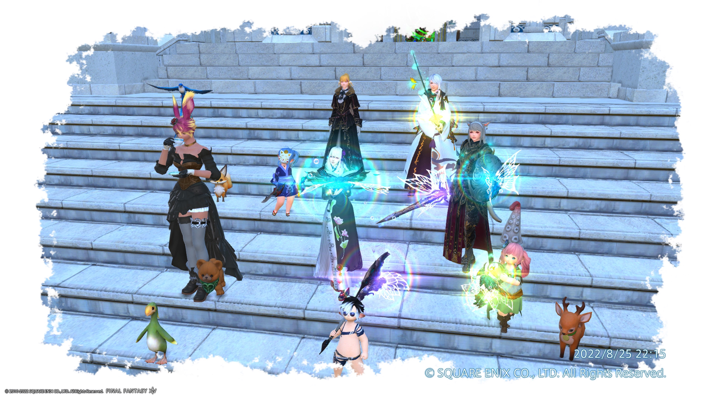
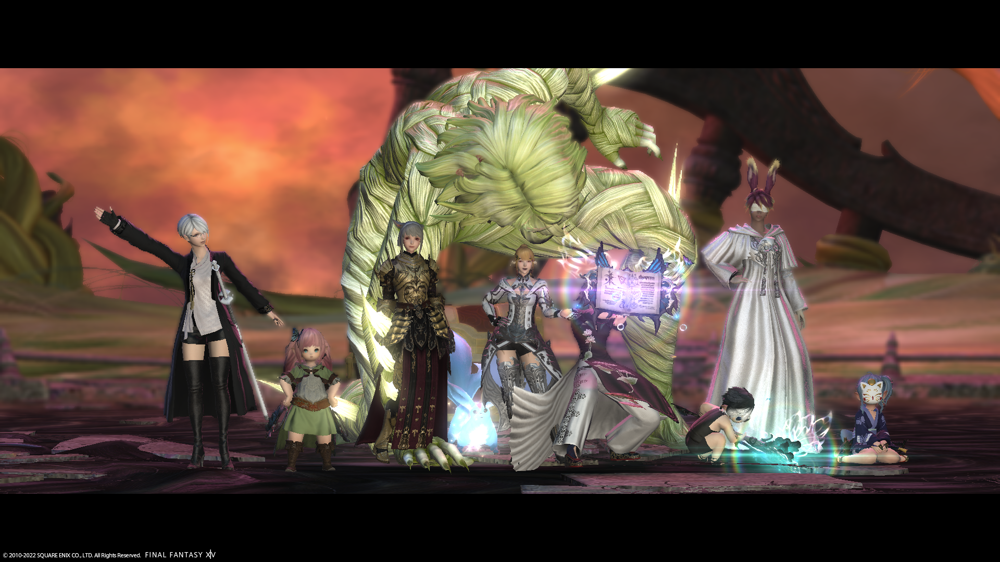
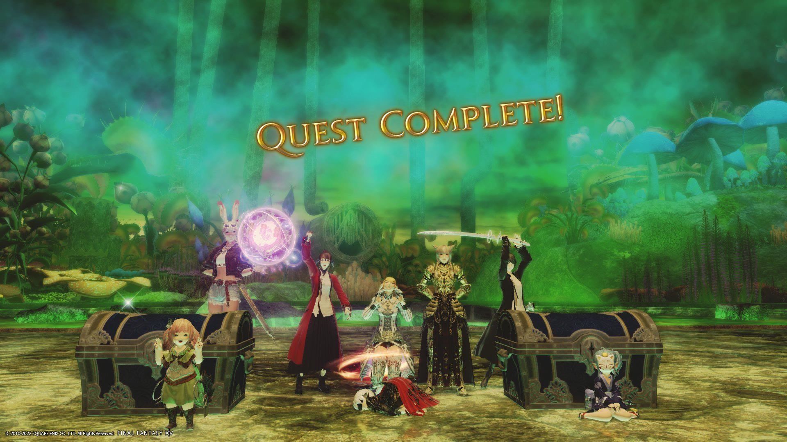
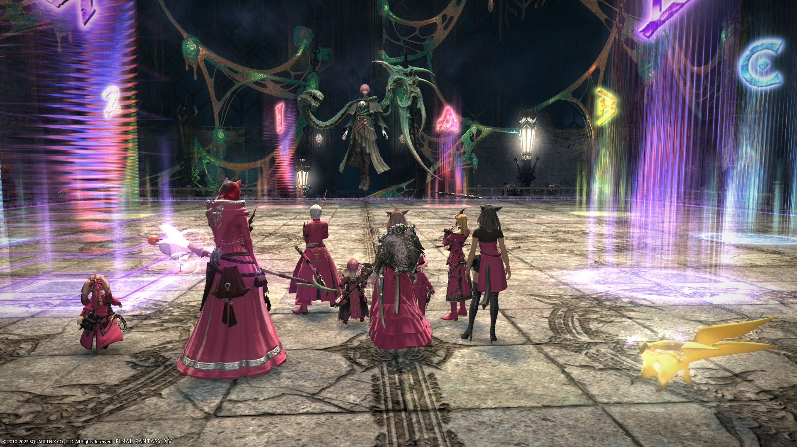
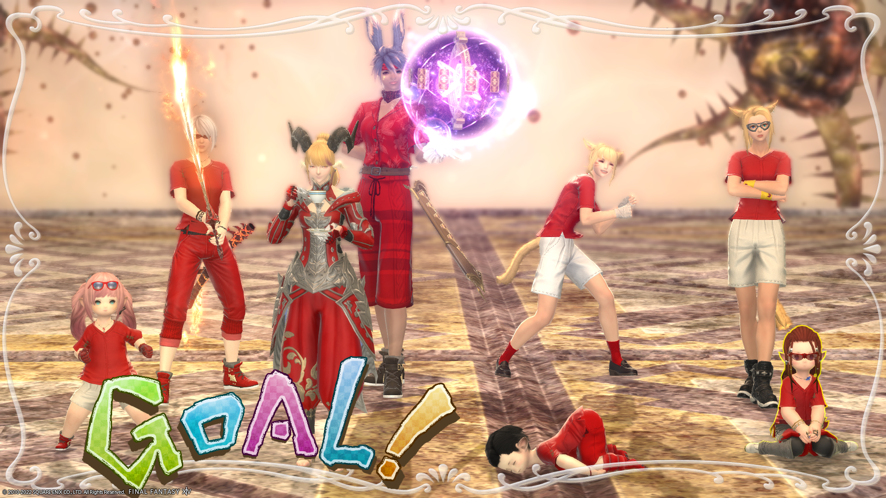

# 万魔殿パンデモニウム：煉獄編について

## 前置き
- レポート作成は2023年5月12日
    - 煉獄編を攻略していたのは2022年9月～
    - メモなどは特になし
    - 手がかりはDiscordサーバのログのみ
    - 記憶力に自信はありません

::: warning
本レポート内容の信頼度は**約3割**程度かもしれません。
:::

 

## 活動開始
- 零式攻略スタートは2022年9月6日＜パッチ6.2実装の2週後＞（だったはず）
    - 早期攻略ではなく攻略トレースの方針だったため、攻略情報がある程度出揃ってからにしようと決めた
        - ~~新式装備も少し安くなってニッコリ~~
- 基本的な活動方針は辺獄編から引き継いだ
    - ほとんどその前の週まで何かに付けて活動していたため、ぬるりと始まった
- 煉獄編零式が実装された初週は、極討伐戦をチームでクリアし活動にお茶を濁した
- 辺獄編から引き続き、野良での攻略について特に制限無し
    - 早めにクリアしたメンバーには他のメンバーへのケア等の早期攻略特典

 

## 攻略時
- 1層は活動2日目/初週でクリア
    - 事前に見ていた攻略動画の感想ではクリアについてネガティブな意見が多かった
    - 倒れながらもリカバリーできるギミックがあった
        - 特にタンクロールの無敵スキルとプレイヤースキルが輝いた
    - 即死するギミックに苦しめられた
    - 後の活動週で、クリア済みにも関わらず1層で失敗することが多々あった
    - 雑談のし過ぎて集中できていないことを理由によく怒られた

    
 

- 2層は活動2週目/約1週ぐらいにクリア
    - 記録があまり見当たらなかったため、特に攻略にかかった時間が曖昧
       - 1層のクリアSSと3層のクリアSSは明確に残っていたため、各層の難易度を加味して計算
    - パターンの記憶がいくつかあり、得意不得意の明暗が分かれやすい層だった
        - 早めにクリアしていたメンバーにVCでのコールを頼むことで、おんぶにだっこで解決
    - 雑談のし過ぎて集中できていないことを理由によく怒られた

    
 

- 3層は活動4週目/約2週にクリア
    - 一つのコンテンツとしての通し時間とギミックのバランスが絶妙で、クリア後の周回でも何度も失敗した
    - 画期的なギミックの処理方法が一般に広まっていたため、トレースが比較的容易になっていた
    - 雑談のし過ぎて集中できていないことを理由によく怒られた

    
 

- 4層前半は3層クリアから約1ヶ月/4週で越えた
    - パンデモニウムシリーズの2つ目の4層ということで歯応えバッチリ
    - 辺獄編のときよりも強化されたギミックと、そのパターン、そしてギミックのペースに大苦戦
    - 火力チェックによく引っかかったため、120sのバーストタイミングを各々強く意識するようになった
    - 画期的な攻略法や先駆者のアドバイスでもカバーし切れず、着実に練習を重ねることが一番の近道だった
    - クリア後の周回でも少しのミスが命取りになった
    - 雑談のし過ぎて集中できていないことを理由によく怒られた
    
 

- 4層後半は4層前半を越えた後、更に約1ヶ月/4週でクリア
    - 4層前半を安定してクリアさせることが攻略中の課題だった
    - これまで比較的比重が小さかったヒーラーロールの比重も大きくなり、なんとなくでやっていたヒーラーも動きを詰める必要があった
        - ぼんやりとしていたバリアヒーラーは誰でしょう？~~そう、私です！~~
    - 辺獄編の4層と同様に、終盤クリアできそうになった際には活動時間の延長を行った
    - クリア後の周回でも少しのミスが命取りになりかねなかった
        - 前述に漏れず周回でも失敗が多かった
    - 雑談のし過ぎて集中できていないことを理由によく怒られた

    
 

- 全体を通して攻略期間は約12週/約3ヶ月
    - 辺獄編と同様にゆっくり攻略することができた
    - 辺獄編同様、4層の攻略期間がその大部分を締めた
        - 進捗が見えにくくなりモチベーションの維持は今後も課題
            - 攻略を「するため」のモチベーションというよりは、攻略を「したくなる」モチベーションという方向で考えられないか検討中
            - アイディア募集

 

## 攻略後
- 4層攻略終了後、各メンバーの装備のため周回
- 周回時もなかなか安定させることができなかった
- 雑談のし過ぎて集中できていないことを理由によく怒られた
- 周回終了後、プレイスタイルの違いからメンバーが1人脱退
    - この際に活動内容について改めて話し合い、6.4で実装予定のレイド攻略までチームとしての活動は休止することにした